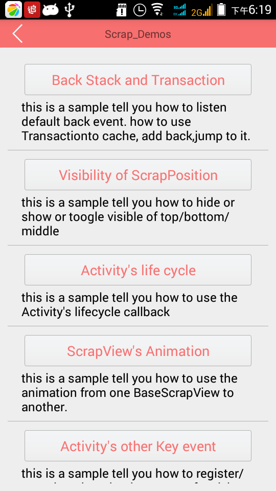

# android-scrap
this is really One Activity Framework named android-scrap, a little like fragment.  
it helps you to reduce number of activities  and avoid some problems of fragment.
.


## Features
- Really One Activity
- Support animation(Animation or Animator or ViewPropertyAnimator) between two children of the 'BaseScrapView'.
- Support cache BaseScrapView and add it to the back stack.
- Support multi modes of back stack.
- Support listen to Activity's Lifecycle and event.
- Support fast set properties of view ,named 'ViewHelper'.
- Support hide or show the loading view.
- Support the entry of scrap view ( similar to the MainActivity).
- Integreted google-Volley and expand it to support  file upload and circle/round image. and you can see it in demo.
- Integrated QuickAdapter and expand it to use easily and support multi item Adapter. based on [JoanZapata/base-adapter-helper](https://github.com/JoanZapata/base-adapter-helper) and thanks for him.
- the more to see in demo or source code


## Changelog
-  # 1.0
     - support once animation when you jump, you can use it in Transaction.
-  # 1.1 
     - Support hide or show the loading view.
     - Support the entry of scrap view ( similar to the MainActivity) 
           - 1,create file 'scrap_config.properties' in res/raw like this.
            
              - define the main scrap view
                     - scrap_view_main = org.heaven7.scrap.sample.MainScrapView
              - define the main scrap view whether add it to back stack
                     - scrap_view_main_addBackStack = true
            
           - 2, declear really main activity
            ``` java
             <activity android:name="org.heaven7.scrap.core.ContainerActivity"
              >
                  <intent-filter>
                     <action android:name="android.intent.action.MAIN" />
     
                     <category android:name="android.intent.category.LAUNCHER" />
                 </intent-filter>
             </activity>
             ```
     - optimize code.
  
## TODO
   * other idea
   * Support databinding . wait for the databing of google lib is stable .
   
## issue
   * if you have a good suggestion  about this, please tell me. Thanks! 
   * This is just a beginning, may have bugs ,  so if you have any question , please tell me . i will do my best to resolve it. Thanks !
   
## About me
   * heaven7 
   * email: donshine723@gmail.com or 978136772@qq.com   
   
## hope
i like technology. especially the open-source technology.And previous i didn't contribute to it caused by i am a little lazy, but now i really want to do some for the open-source. So i hope to share and communicate with the all of you.

### How to use 
- in android studio gradle of android studio:       
      - add dependence ,
 
          ``` java
          dependencies {
              compile 'org.heaven7.scrap:android-scrap:1.1'
          }
          ```
   
## Demo
in model [android-scrap/sample](https://github.com/LightSun/android-scrap/tree/master/Android-Scrap/samples).



``` java
//[1], want jump to target ScrapView ( child of BaseScrapView)
 ScrapHelper.jumpTo(new EntryScrapView(MainActivity.this));
 
//[2], want cache ,add back stack, and jump , with data and animation 
//this animate executor only use once . 
 Bundle b = new Bundle();
 b.putInt("id",id+1);

 crapHelper.beginTransaction().changeBackStackMode(ArrayList2.ExpandArrayList2.Mode.Normal)
           .cache(new EntryScrapView(MainActivity.this)).addBackAsTop())
           .animateExecutor(animateExecutor).withExtras(b).jump().commit();

                        
//[3], animation between two children of the 'BaseScrapView'. 
 // here use animator to perform animation between two ScrapViews.
    private AnimateExecutor animateExecutor = new AnimateExecutor() {
        @Override//use animator
        protected AnimateCategoryType getType(boolean enter, BaseScrapView previous, BaseScrapView current) {
            return AnimateCategoryType.Animator;
        }

        @Override
        protected Animator prepareAnimator(View target, boolean enter, BaseScrapView previous, BaseScrapView current) {
            if(!enter){
                //exit
                return ObjectAnimator.ofFloat(target, "translationX", 0, 200)
                        .setDuration(2000);
            }else{
                // if it is the first BaseScrapView,return null to make it not to animate.
                if(previous == null)
                    return null;
                //enter
                return ObjectAnimator.ofFloat(target,"translationX", 200, 0)
                        .setDuration(2000);
            }
            // AnimatorInflater.loadAnimator(context, id)
        }
    };
    
     //set animate executor (it it the global's animate executor, it will be only used if 
     //        once animateExecutor is null )
     
     ScrapHelper.setAnimateExecutor(animateExecutor);
     
     //[4], event of activity 
      callback = new ActivityEventAdapter() {
            @Override
            public boolean onKeyDown(int keyCode, KeyEvent event) {
                ScrapLog.i("callback onKeyDown","");
                return super.onKeyDown(keyCode, event);
            }

            @Override
            public boolean onBackPressed() {
                ScrapLog.i("callback onBackPressed","");
                return super.onBackPressed(); //if return true. the all BaseScrapView can't receive back event.
            }

            @Override
            public boolean onTouchEvent(MotionEvent event) {
                ScrapLog.i("callback onTouchEvent","");
                return super.onTouchEvent(event);
            }
            //...etc methods
        };
        // the callback is regist as the global. so if the ScrapView is detached and you don't need, don't forget to 
        // unregister it.
        ScrapHelper.registerActivityEventCallback(callback);
        
        //[5],QuickAdapter and ViewHelper. in a child of 'BaseScrapView'
         @Override
    protected void onAttach() {
        super.onAttach();
        showToast("CommonView is attached");
        getViewHelper().setOnClickListener(R.id.iv_back, new View.OnClickListener() {
            @Override
            public void onClick(View v) {
                onBackPressed();
            }
        }).setOnClickListener(R.id.bt_1, new View.OnClickListener() {
            @Override
            public void onClick(View v) {
                showToast("button1 was clicked");
            }
        }).setOnClickListener(R.id.bt_2, new View.OnClickListener() {
            @Override
            public void onClick(View v) {
                showToast("button2 was clicked");
            }
        }).setOnClickListener(R.id.bt_3, new View.OnClickListener() {
            @Override
            public void onClick(View v) {
                showToast("button3 was clicked");
            }
        });
        //set the list view's data
        //use QuickAdapter to fast set adapter.
        addGirlDatas();
        getViewHelper().setAdapter(R.id.lv, new QuickAdapter<GirlData>(R.layout.item_girl,mGirlData) {
            @Override
            protected void convert(Context context, int position, ViewHelper viewHelper, GirlData item) {
                   viewHelper.setText(R.id.tv,item.name);
                   viewHelper.setImageUrl(R.id.eniv, item.imageUrl, new ImageParam.Builder()
                           .placeholder(R.mipmap.ic_launcher).error(R.mipmap.ic_launcher).circle().create());
            }
        });
    }
        
        //[6], ....etc in demos

```

## License

    Copyright 2015   
                    heaven7(donshine723@gmail.com)

    Licensed under the Apache License, Version 2.0 (the "License");
    you may not use this file except in compliance with the License.
    You may obtain a copy of the License at

       http://www.apache.org/licenses/LICENSE-2.0

    Unless required by applicable law or agreed to in writing, software
    distributed under the License is distributed on an "AS IS" BASIS,
    WITHOUT WARRANTIES OR CONDITIONS OF ANY KIND, either express or implied.
    See the License for the specific language governing permissions and
    limitations under the License.
